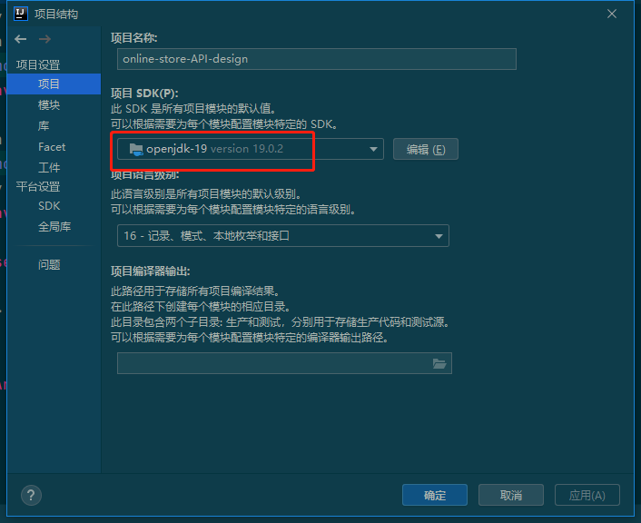
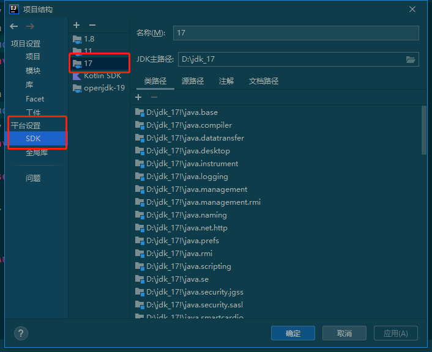
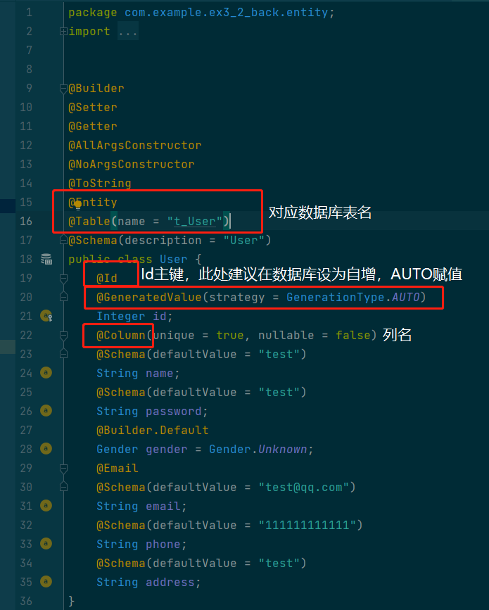
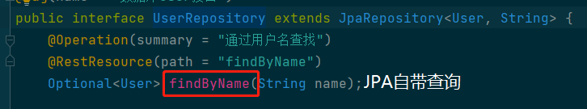
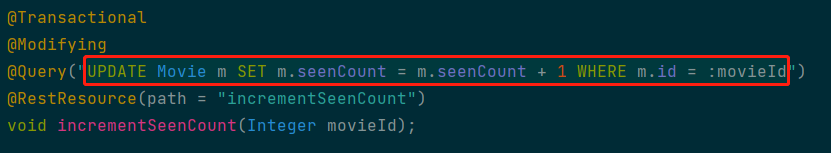
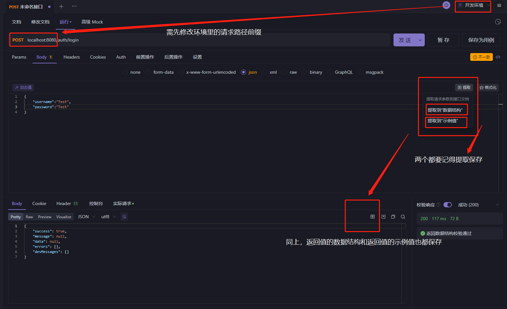
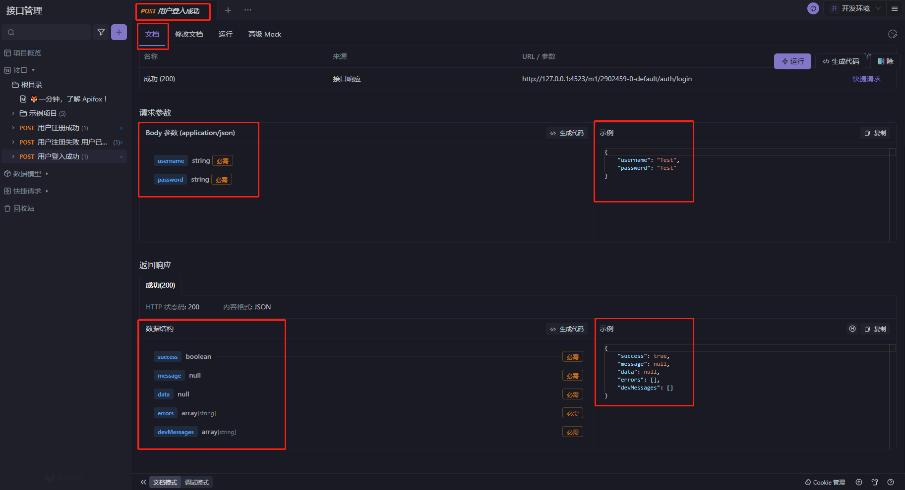

## 已实现功能

### **用户**

- [x] 用户注册
- [x] 登录
- [x] 访问令牌刷新

### **商品管理**

##### 基础功能

- [x] 获取商品列表
- [x] 根据商品名查询详情
- [x] 搜索
- [x] 评价

##### 附加功能

- [x] 根据id查询详情
- [x] 根据店家id查询详情
- [x] 增加商品
- [x] 根据ID删除商品	
- [x] 根据商品名删除商品
- [x] 根据ID修改商品信息
- [x] 商品上架
- [x] 商品下架
- [x] 删除所有商品

### 购物车管理

#### 基础功能

- [x] 添加商品  **通过用户ID，商品ID和数量添加商品**
- [x] 删除商品  **通过用户ID和商品ID删除商品 通过用户ID和商家ID删除商品 通过用户ID和分类ID删除商品**
- [x] 更新商品数量 **更改商品数量**
- [x] 获取详情 **通过用户ID展示购物车商品详情 & 通过用户ID、商店ID、商品类别ID展示购物车商品详情**

#### 附加功能

- [x] 通过用户ID查找对应的购物车item

- [x] 通过用户Id和商家Id查找购物车

  

### 订单管理

- [x] 订单创建
- [x] 查询订单列表 **通过用户ID**
- [x] 查询订单商品 **通过订单ID**
- [ ] 详细查询
- [x] 删除订单 **通过订单ID**
- [x] 删除所有订单
- [ ] 订单设为已支付 **通过订单ID**
- [ ] 订单设为已发货 **通过订单ID**
- [ ] 订单设为已完成 **通过订单ID**

### *其余附加功能*

#### 商家管理

- [x] 展示商家列表
- [x] 查询商家信息
- [x] 删除商家信息
- [x] 修改商家信息
- [x] 插入商家信息
- [x] 删除所有商家

#### 分类管理

- [x] 展示分类列表
- [x] 查询分类信息
- [x] 删除分类信息
- [x] 修改分类信息
- [x] 插入分类信息
- [x] 删除所有分类信息

#### 用户管理

- [x] 查询所有用户
- [x] 查询单个用户
- [x] 创建新用户
- [x] 删除用户
- [x] 删除所有用户

# README

## 项目构建

在设置→项目结构，选择项目SDK为openjdk-19

平台设置SDK选择jdk_17

可以选择更高版本来兼容，不过还是选一样的吧，防止哪里又踩坑(*^_^*)

## 代码目录介绍

* src

  * main

    * java
      * com/example/ex3_2_back
        * configuration Cors、Swagger等的配置， Spring容器可以使用这些方法来注入Bean 
        * controller 控制层
        * domain domain层，定义相关接口的数据结构
        * entity 实体类，此处使用JPA可直接在数据库生成对应表
        * exception ExceptionHandler返回相关异常信息
        * interceptor 拦截器，用于token验证
        * repository 与数据库相连的持久层，部分操作需要使用JPQL语句
        * service 一些复用程度高的功能需要在这实现
        * utils 后端运行入口
      * resources .相关配置文件yaml

  * test

    * java/com/example/ex3_2_back
      * repository 持久层相关方法的测试
      * utils  验证是否能够成功加载 Spring 上下文的测试 

    

## JPA & JPQL

### JPA

 Java Persistence API，可以通过注解或者XML描述【对象-关系表】之间的映射关系，并将实体对象持久化到数据库中。 一些注释略解（如下👇）

还有其他许多注解对应不同功能，需根据实际情况灵活选用。

### JPQL

JpaRepository自带的可直接使用的简单查询（如下👇）有时候满足不了我们的需求

我们经常需要 **@Query结合jpql语句进行查询等操作** 

一个更新数据库值的一个简单示例（如下👇）

还有其他许多注解对应不同功能，需根据实际情况灵活选用。

## 测试用例

编写测试用例时的一些注意事项（如下👇）

完成后 **保存为用例**，效果（如下👇）

